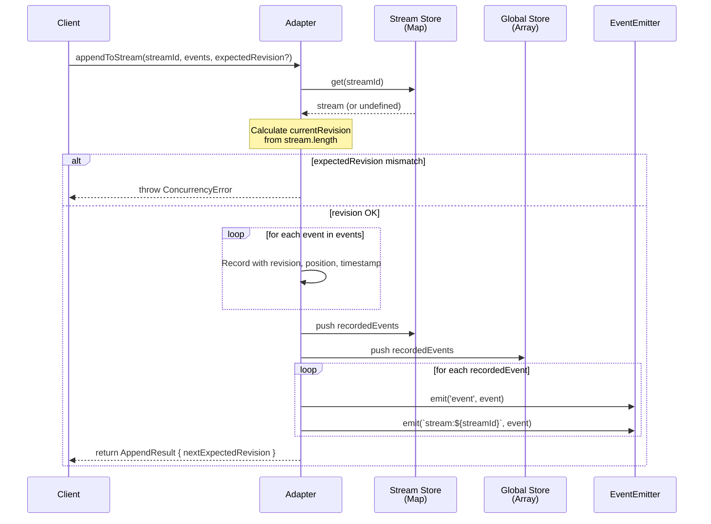
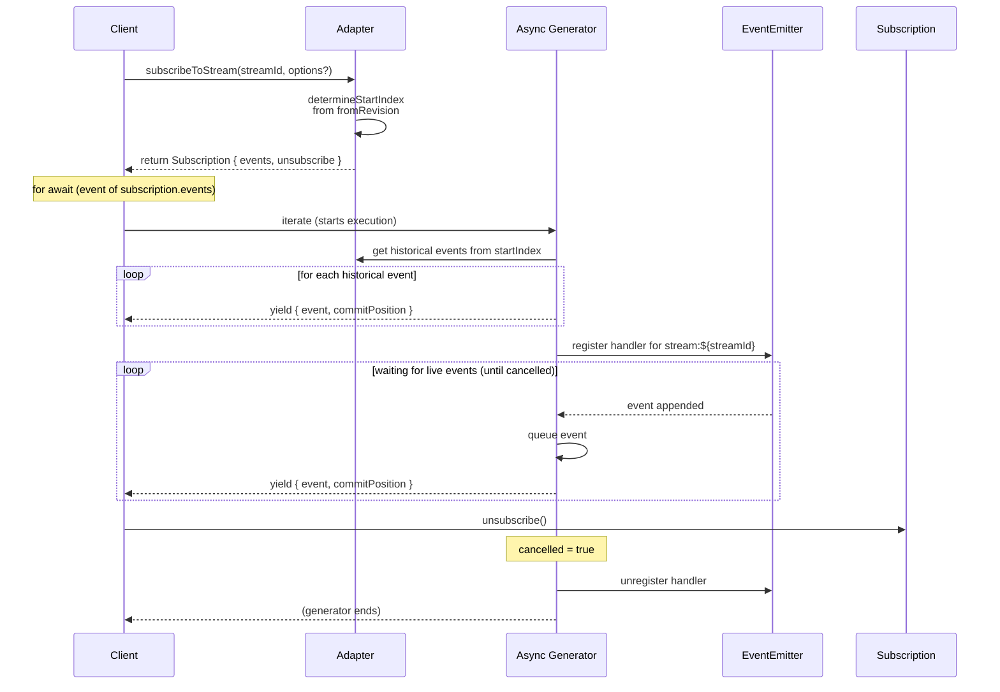
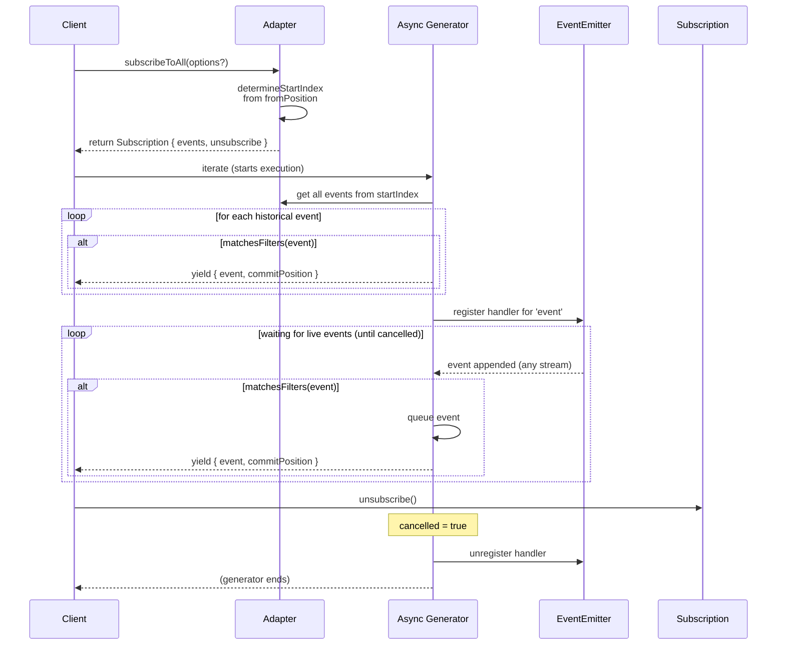
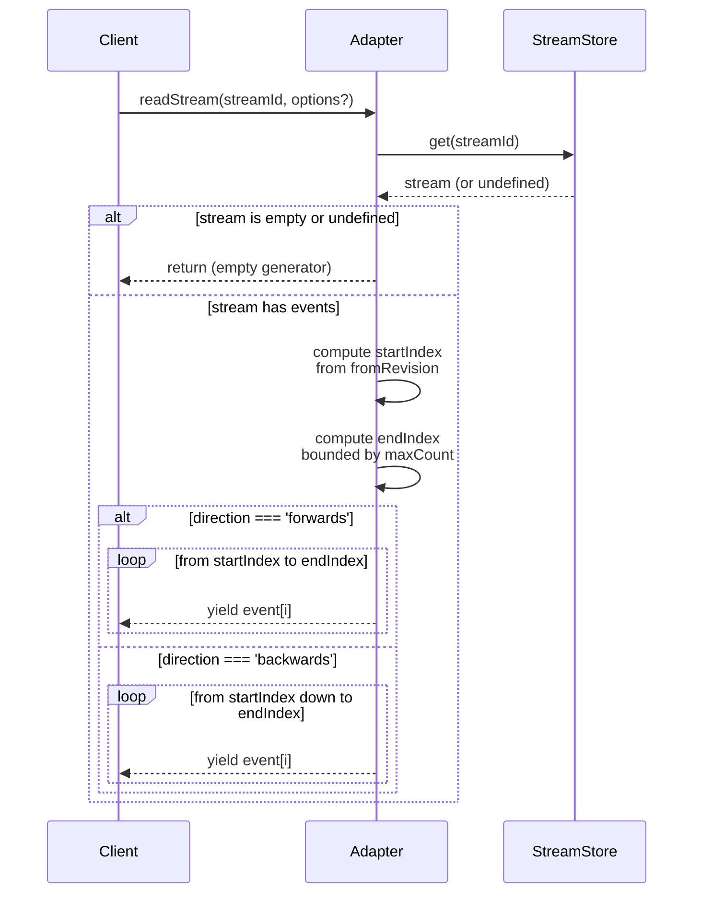

# Module: adapter-in-memory

## Overview

The `adapter-in-memory` module provides an in-memory implementation of `IEventStoreAdapter` for the NestJS CQRS Event Store library. It implements the full adapter interface using Node.js `EventEmitter` for internal event signaling, storing events in memory in two parallel structures: a per-stream `Map` for stream-specific access and a global array for chronological traversal. This adapter is optimized for local development, testing, and integration testing scenarios where persistence to a real database is not required. Events are held in memory and are lost when the process exits. The module includes specialized test helper methods (`getStream`, `getAllStreams`, `getAllEvents`, `clear`) to support testing assertions and cleanup.

## API Surface

| Export | Type | Purpose |
|--------|------|---------|
| `InMemoryEventStoreAdapter` | Class | Concrete implementation of `IEventStoreAdapter` with `@Injectable()` decorator for NestJS integration. Provides append, read, and subscription operations entirely in-memory. |
| `appendToStream(streamId, events, expectedRevision?)` | Method | Appends events to a named stream with optional optimistic concurrency control. Returns `AppendResult` with next expected revision. Emits internal events for live subscriptions. |
| `readStream(streamId, options?)` | Async Generator | Reads historical events from a stream with configurable direction (forwards/backwards), starting position, and result limit. Returns empty if stream doesn't exist. |
| `subscribeToStream(streamId, options?)` | Method | Creates a catch-up subscription to a single stream: yields historical events from a starting point, then continues with live events. Returns `Subscription` with async iterable and unsubscribe. |
| `subscribeToAll(options?)` | Method | Creates a catch-up subscription to all events across all streams with optional filtering by event type prefix or stream name prefix. Returns `Subscription` with async iterable and unsubscribe. |
| `getStream(streamId)` | Method | Test helper: returns a defensive copy of all `RecordedEventEnvelope` objects in a specific stream, or empty array if stream doesn't exist. |
| `getAllStreams()` | Method | Test helper: returns a shallow copy of the internal streams `Map<string, RecordedEventEnvelope[]>` for inspection. |
| `getAllEvents()` | Method | Test helper: returns a shallow copy of the global events array in chronological order. |
| `clear()` | Method | Test helper: resets all internal state (clears streams, global events array, resets position counter to 0, removes all event listeners). |

**Note:** Serena unavailable — API surface verified via text search and direct file inspection.

## Core Flows

### Append Events with Optimistic Concurrency Control

When `appendToStream(streamId, events, expectedRevision?)` is called, the adapter checks if the stream exists and validates the expected revision against the current stream length. If the revision matches (or is undefined), events are enriched with system metadata (stream ID, revision within stream, global position, created timestamp), added to both the per-stream storage and global events array, and internal event signals are emitted to wake live subscriptions. The next expected revision is returned. If revision mismatch occurs, an error is thrown immediately.

### Catch-Up Subscription to a Single Stream

When `subscribeToStream(streamId, options?)` is called, the adapter creates an async generator that first yields all historical events from a starting point (derived from `fromRevision`), then transitions to live mode where it listens for future appends on that stream via `EventEmitter`. The generator maintains an event queue and uses promise-based signaling to pause and resume consumption as events arrive. The `Subscription` object provides an async iterable and an `unsubscribe()` method that sets a flag to stop the generator and clean up the listener.

### Catch-Up Subscription to All Events with Filtering

When `subscribeToAll(options?)` is called, the adapter creates an async generator that yields all historical events (optionally filtered by event type and/or stream name prefixes), then transitions to live mode. Filtering is applied consistently to both historical and live events: for event type, prefixes in the filter array are checked with `startsWith()` against the event's type; for stream name, prefixes are checked against the stream ID. The generator uses the same queue-and-signal pattern as stream subscriptions but listens on the global `'event'` signal instead.

### Read Stream History

When `readStream(streamId, options?)` is called, the adapter retrieves the stream from storage and yields events in the requested direction (forwards or backwards) from a starting position. The starting position can be `'start'` (index 0), `'end'` (last event), or a specific revision number. Yields are bounded by `maxCount`. If the stream doesn't exist, an empty iterable is returned, semantically equivalent to "no events in stream."

## Patterns

**Adapter Pattern**: Implements the `IEventStoreAdapter` interface contract from the core module, allowing the in-memory adapter to be transparently swapped with other adapters (KurrentDB, PostgreSQL) via dependency injection.

**Async Generator Pattern**: Both `readStream()` and the subscription event generators use async generator functions to provide lazy, pull-based iteration over events. This defers computation and allows streaming without buffering entire result sets in memory.

**EventEmitter for Internal Signaling**: Uses Node.js `EventEmitter` internally to coordinate between append operations and live subscriptions. Emits two signals per event: a global `'event'` for `subscribeToAll`, and a scoped `stream:${streamId}` for `subscribeToStream`. This allows multiple subscriptions to coexist without polling.

**Queue and Promise-Based Signaling in Generators**: Live subscriptions maintain an event queue and use promise-based signaling (`resolveWait`) to pause the generator when the queue is empty and resume it when new events arrive. This avoids spinning or blocking and integrates cleanly with async iteration.

**Test Helper Methods**: Provides public methods (`getStream`, `getAllStreams`, `getAllEvents`, `clear`) alongside the main adapter interface to support test assertions and cleanup without exposing private state.

**Optimistic Concurrency Control**: Uses stream revision (event count) for optimistic concurrency checks. Clients supply an expected revision; if current revision differs, an error is thrown, preventing lost-update conflicts.

## Cross-Cutting Concerns

**Concurrency Control**: Enforces optimistic concurrency by comparing `expectedRevision` against the current stream length before appending. Uses bigint for revision and position to prevent overflow. Does not provide distributed locking or pessimistic concurrency.

**Error Handling**: Throws a plain `Error` with a descriptive message on revision mismatch. No custom error types are defined; error handling is delegated to callers.

**State Management**: Maintains state in three structures:
  - `streams: Map<string, RecordedEventEnvelope[]>` — per-stream event log.
  - `allEvents: RecordedEventEnvelope[]` — global chronological log.
  - `globalPosition: bigint` — monotonic counter for position.commit.
  These are never cleared outside of explicit `clear()` calls, making state mutable and potentially unsafe in highly concurrent scenarios. Event Emitter also accumulates listeners until explicitly unsubscribed.

**Position and Revision Semantics**:
  - **Revision**: Per-stream index, 0-based. Used for optimistic concurrency. Advances with each append.
  - **Position**: Global { commit, prepare } pair. Both set to the same `globalPosition` value and incremented per event appended.
  - **fromRevision** and **fromPosition** can be string literals (`'start'`, `'end'`) or numeric values.

**NestJS Integration**: Decorated with `@Injectable()` for NestJS dependency injection. Compatible with peer dependencies `@nestjs/common ^11.0.0` and `@pbuda/nestjs-event-store 0.3.6`.

**No Persistence**: Events are volatile and lost on process exit. No connection management, transaction handling, or durability guarantees.

**No Logging**: No debug or error logging output; all diagnostics are implicit in error messages and test helper methods.

## Dependencies

**Depends on:**
  - `@pbuda/nestjs-event-store` (core): Imports `IEventStoreAdapter`, `EventEnvelope`, `RecordedEventEnvelope`, `ResolvedEventEnvelope`, `AppendResult`, `ReadStreamOptions`, `Subscription`, `SubscribeToStreamOptions`, `SubscribeToAllOptions` types and interfaces.
  - `@nestjs/common`: Imports `Injectable` decorator.
  - Node.js built-in `events` module: Uses `EventEmitter` for internal signaling.

**Depended on by:**
  - `apps/example-app` (example-app-root): Imported in `app.module.ts` and conditionally instantiated as the default adapter when `EVENT_STORE_ADAPTER` environment variable is not set to `'kurrentdb'`.
  - Any consumer of `@pbuda/nestjs-event-store-in-memory` (published npm package at version 0.3.6).
